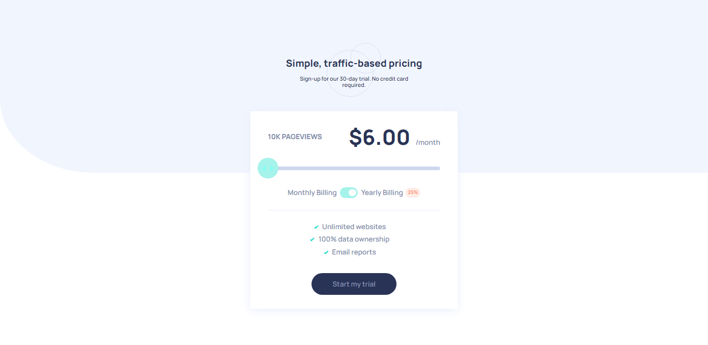

# Frontend Mentor - Interactive pricing component solution

This is a solution to the [Interactive pricing component challenge on Frontend Mentor](https://www.frontendmentor.io/challenges/interactive-pricing-component-t0m8PIyY8). Frontend Mentor challenges help you improve your coding skills by building realistic projects.

## Table of contents

- [Overview](#overview)
  - [The challenge](#the-challenge)
  - [Screenshot](#screenshot)
  - [Links](#links)
- [My process](#my-process)
  - [Built with](#built-with)
  - [What I learned](#what-i-learned)
  - [Continued development](#continued-development)
  - [Useful resources](#useful-resources)
- [Author](#author)
- [Acknowledgments](#acknowledgments)

## Overview

### The challenge

Users should be able to:

- View the optimal layout for the app depending on their device's screen size
- See hover states for all interactive elements on the page
- Use the slider and toggle to see prices for different page view numbers

### Screenshot



### Links

- Solution URL: https://github.com/robertoms99/Interactive-pricing-component
- Live Site URL: https://interactive-pricing-component-challenge.netlify.app/

## My process

### Built with

- Semantic HTML5 markup
- CSS custom properties
- NormalizeCSS
- Flexbox
- CSS Grid
- Sass
- Autoprefixer
- Mobile-first workflow
- Vanilla js, without libraries
- All components were created with my html, css and js

### What I learned

In this challenge, I learned about functional programming,
I have never designed with Mobile-first workflow

slider:

```html
<div class="slide pricing__slide" data-slide data-slide-value="10000">
	<span class="slide__thumb" data-slide-thumb>
		
	</span>
</div>
```

toggle:

```html
<div class="toggle pricing__billing-toggle" data-toggle data-toggle-checked></div>
```

This css rule, make the magic with the slider thumb:

```css
left: calc((var(--calculated-percentage) * 1%) - var(--slide-thumb-radio));
```

I am proud of my new js' knowledges:

```js
const slideSteps = [...priceByViews.keys()].reduce((slideSteps, key, index) => {
	slideSteps[index + 1] = key;
	return slideSteps;
}, {});
```

### Continued development

At this moment I am finishing my javascript topics, I will do many more challenges, I will learn more about design patterns and then I will reinforce my little knowledge of Reactjs

## Author

- Website - :(
- Frontend Mentor - [@robertal99](https://www.frontendmentor.io/profile/robertal99)
